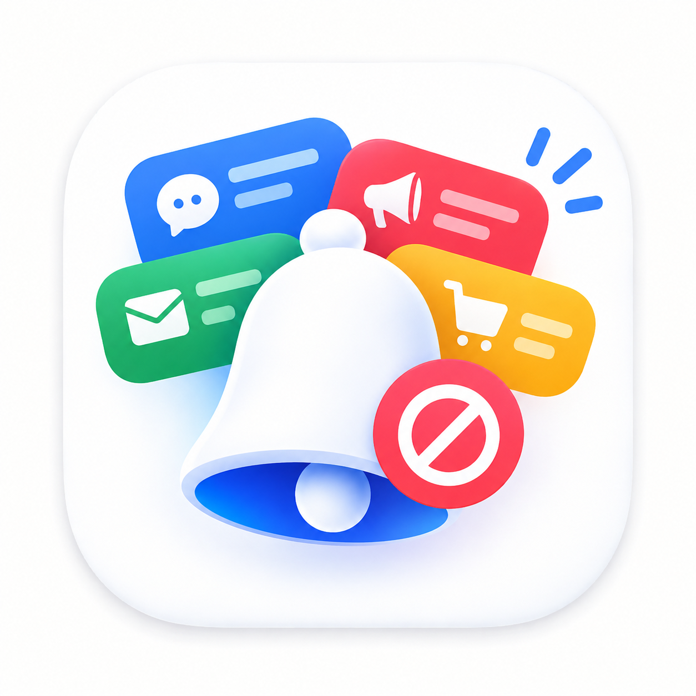

<p align="center"></p>

<h1 align="center">NotiShade</h1>

<div align="center">

[](https://developer.android.com)
[](https://kotlinlang.org)
[](https://developer.android.com/compose)
[](https://m3.material.io)
[](LICENSE)

*Control your notifications by what they're about — across all apps at once, entirely on your device.*

[Download](#install) • [Features](#features) • [Building](#building)

</div>

---

## Features

- **Categories across apps**: channels from every installed app are grouped into categories like Promotions, Social activity, Messages and Security. Block, silence or allow a whole category in one go, or select individual apps.
- **Notification history**: every notification is kept for 7 days in Logs, with blocked ones clearly marked. Filter by app, category, or shown/blocked, and search across titles, text, apps and channels.
- **Blocking with a record**: blocked notifications are hidden as they arrive and saved in Logs, so you can check what you missed and allow a category again.
- **Per-app control**: apply one action to every channel of an app, and set a default for channels the app adds later.
- **Quiet hours**: time-based schedules per category or rule, with day-of-week support and midnight-wrapping windows.
- **Keyword rules**: remove individual notifications whose text matches words you choose, for apps that mix promotions into normal channels.
- **Quick Settings tile**: pause and resume all blocking from the notification shade.
- **Home-screen widget**: blocked-notification count at a glance.
- **Backup & export**: full settings backup as JSON, notification history export as CSV or JSON.
- **Log exclusions**: keep private apps (e.g. messengers) out of the history.
- **Undo**: every change can be undone from the change history.
- **Localized**: English, Spanish, German and Arabic (full RTL support).

## Tech Stack

| Layer | Technology |
| --- | --- |
| Language | Kotlin (JVM 17), coroutines + Flow |
| UI | Jetpack Compose, Material 3, edge-to-edge |
| Persistence | kotlinx-serialization JSON files (atomic writes) |
| System integration | Notification Listener + companion-device pairing |
| Build | Gradle Kotlin DSL, AGP, single `:app` module, R8 minified release |
| Tests | JUnit 4 unit tests on pure logic (classifier, rules, history, backup) |

## Project Structure

```
app/src/main/java/app/notishade/
  backend/    system-API wrappers (notification access, channel writes)
  data/       models, classifier, JSON stores, codecs, pure logic
  engine/     BulkEngine: batched channel changes + undo
  service/    NotificationListenerService (hot path)
  widget/     blocked-count home-screen widget
  ui/         Compose screens + MainViewModel
  service/    Quick Settings pause tile
```

## Quick Start / Building

Requires JDK 17 and the Android SDK.

```sh
./gradlew assembleDebug          # app/build/outputs/apk/debug/app-debug.apk
./gradlew testDebugUnitTest lintDebug
```

Debug builds use the application ID `app.notishade.debug`, so they install alongside a release build.

<details>
<summary>Testing on an emulator</summary>

Emulators have no nearby devices to pair with, so grant both permissions with adb:

```sh
adb shell cmd notification allow_listener app.notishade.debug/app.notishade.service.NotifListener
adb shell cmd companiondevice associate 0 app.notishade.debug 02:00:00:00:00:01
```

</details>

## Usage

1. Install the APK and grant **Notification access** and the **companion pairing** when prompted during setup.
2. Open a category (Promotions, Social, …) and tap **Block** — every channel in that category, across all apps, is silenced and future notifications are removed on arrival and logged.
3. Check **Logs** any time to see what arrived and what was blocked; every change can be undone.

## FAQ / Troubleshooting

- **The notification-access switch is greyed out.** Android may block it for sideloaded apps. Open **App info → ⋮ → Allow restricted settings**, then try again.
- **A category was already off in Android Settings.** NotiShade takes it over so it's logged too. Notifications from before setup can't be recovered.
- **An app's notifications never appear in Logs.** If its main notification switch is off, Android drops everything before any app can see it. Turn the switch on and block its categories in NotiShade instead.
- **What happens if I uninstall?** Categories NotiShade blocked stay *Minimized* and will start appearing silently. Allow them in NotiShade first, or re-block them in Android Settings.

## Privacy

- No internet permission. NotiShade can't send anything anywhere.
- Notification history is stored only in the app's private storage, kept for 7 days, and excluded from Android backups and device transfers.
- Clearing history, excluding an app, or uninstalling deletes the stored notifications.

| Permission | Why |
| --- | --- |
| Notification access | Read incoming notifications, and read and change other apps' notification channels |
| `QUERY_ALL_PACKAGES` | List your installed apps and their channels |
| `REQUEST_COMPANION_RUN_IN_BACKGROUND` | Keep the companion pairing active in the background |

## Install

Download the APK from [Releases](../../releases) and open it on your phone. Your browser or file manager may ask for permission to install apps.

Each release includes `SHA256SUMS.txt`:

```sh
sha256sum -c SHA256SUMS.txt
```

All releases are signed with the same key. Android refuses to update NotiShade with an APK signed by a different key, which protects you from tampered builds.

## Building (release)

Releases are built and signed by GitHub Actions ([release.yml](.github/workflows/release.yml)):

1. Update `versionCode` and `versionName` in [app/build.gradle.kts](app/build.gradle.kts).
2. Tag the commit with the same version (`git tag v1.0.0 && git push origin v1.0.0`).
3. The workflow checks the tag matches `versionName`, runs tests and lint, builds and signs the APK, and creates a **draft** release with checksums.
4. Review the draft, edit the notes, and publish it.

<details>
<summary>Signing secrets</summary>

| Secret | Value |
| --- | --- |
| `NOTISHADE_KEYSTORE_BASE64` | The keystore file, base64 encoded |
| `NOTISHADE_KEYSTORE_PASSWORD` | Keystore password |
| `NOTISHADE_KEY_ALIAS` | Key alias |
| `NOTISHADE_KEY_PASSWORD` | Key password |

</details>

## Roadmap

- [ ] Configurable history retention (currently fixed at 7 days)
- [ ] Notification history included in settings backup
- [ ] Deep link to Android's restricted-settings page from setup

## Changelog

See [GitHub Releases](../../releases).

## License

Copyright © 2026 Alzimer Ahmed

NotiShade is free software: you can redistribute it and/or modify it under the terms of the
[GNU General Public License v3.0](LICENSE) as published by the Free Software Foundation.

It is distributed in the hope that it will be useful, but WITHOUT ANY WARRANTY; without even
the implied warranty of MERCHANTABILITY or FITNESS FOR A PARTICULAR PURPOSE.

NotiShade bundles the [Inter](https://github.com/rsms/inter) typeface, © The Inter Project Authors,
under the [SIL Open Font License 1.1](docs/licenses/Inter-OFL.txt).
